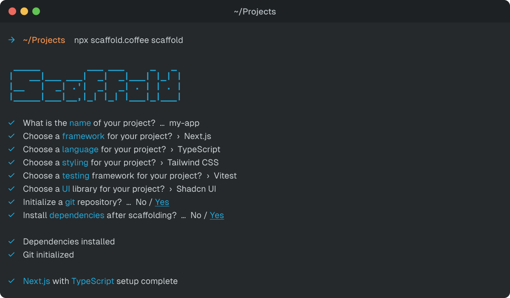

# Scaffold.Coffee

Scaffold.Coffee is a simple, easy-to-use tool for scaffolding out new projects.



<p align="center">
  <a href="https://www.npmjs.com/package/scaffold-coffee">
    
  </a>
  <a href="https://www.npmjs.com/package/scaffold-coffee">
    
  </a>
  <a href="https://github.com/200-coffee/scaffold.coffee/actions">
    
  </a>
  <a href="https://github.com/200-coffee/scaffold.coffee/blob/main/LICENSE">
    
  </a>
</p>

> **Note:** This package is currently in **ALPHA**. Features may change, and there may be bugs. Use at your own risk.

## Features

- **Simple**: Scaffold.Coffee is designed to be simple and easy to use.
- **Open Source**: Scaffold.Coffee is open source and free to use.
- **Community-Driven**: Scaffold.Coffee is community-driven and open to contributions.
- **Modern**: Scaffold.Coffee is built with modern technologies like Node.js and TypeScript.
- **Well-Documented**: Scaffold.Coffee is well-documented and easy to learn.
- **Versatile**: Scaffold.Coffee supports a wide range of templates and projects.

## Usage

You can use Scaffold.Coffee to scaffold out new projects using the `npx` command.

```bash
npx scaffold-coffee scaffold
```

## Templates

While Scaffold.Coffee only currently supports a small set of templates, we are working on adding more templates in the future.

| Template                                 | Version | Author                           | Supported |
| ---------------------------------------- | ------- | -------------------------------- | --------- |
| [Next.js JavaScript](https://nextjs.org) | ^14     | [200.Coffee](https://200.coffee) | ✅        |
| [Next.js TypeScript](https://nextjs.org) | ^14     | [200.Coffee](https://200.coffee) | ✅        |
| [React JavaScript](https://reactjs.org)  | ^17     | [200.Coffee](https://200.coffee) | ❌        |
| [React TypeScript](https://reactjs.org)  | ^17     | [200.Coffee](https://200.coffee) | ❌        |
| [Vue.js JavaScript](https://vuejs.org)   | ^3      | [200.Coffee](https://200.coffee) | ❌        |
| [Vue.js TypeScript](https://vuejs.org)   | ^3      | [200.Coffee](https://200.coffee) | ❌        |
| [Nuxt.js JavaScript](https://nuxtjs.org) | ^2      | [200.Coffee](https://200.coffee) | ❌        |
| [Nuxt.js TypeScript](https://nuxtjs.org) | ^2      | [200.Coffee](https://200.coffee) | ❌        |
| [Svelte JavaScript](https://svelte.dev)  | ^5      | [200.Coffee](https://200.coffee) | ❌        |
| [Svelte TypeScript](https://svelte.dev)  | ^5      | [200.Coffee](https://200.coffee) | ❌        |
| [Laravel PHP](https://laravel.com)       | ^11     | [200.Coffee](https://200.coffee) | ❌        |

## Contributing

If you would like to contribute to Scaffold.Coffee, please read our [contributing guidelines](./CONTRIBUTING.md) to get started.

## License

Scaffold.Coffee is open source and licensed under the [MIT License](./LICENSE).

## Credits

Scaffold.Coffee was created by [200.Coffee](https://200.coffee) and is maintained by [200.Coffee](https://200.coffee).
