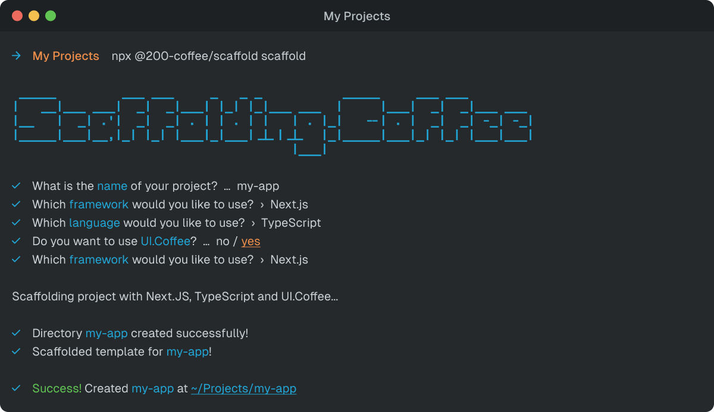

# 200.Coffee/Scaffold

Scaffold.Coffee is a simple, easy-to-use tool for scaffolding out new projects.



<p align="center">
  <a href="https://www.npmjs.com/package/shadcn">
    
  </a>
  <a href="https://www.npmjs.com/package/shadcn">
    
  </a>
  <a href="https://github.com/shadcn-ui/ui/actions">
    
  </a>
  <a href="https://github.com/shadcn-ui/ui/blob/main/LICENSE">
    
  </a>
</p>

## Features

- **Simple**: Scaffold.Coffee is designed to be simple and easy to use.
- **Open Source**: Scaffold.Coffee is open source and free to use.
- **Community-Driven**: Scaffold.Coffee is community-driven and open to contributions.
- **Modern**: Scaffold.Coffee is built with modern technologies like Node.js and TypeScript.
- **Well-Documented**: Scaffold.Coffee is well-documented and easy to learn.
- **Versatile**: Scaffold.Coffee supports a wide range of templates and projects.

## Installation

You can install Scaffold.Coffee using npm, yarn, pnpm, or any other package manager.

```bash
# Using npm
npm install -g @200-coffee/scaffold

# Using yarn
yarn global add @200-coffee/scaffold

# Using pnpm
pnpm add -g @200-coffee/scaffold

#using bun
bun add -g @200-coffee/scaffold

# Using npx
npx @200-coffee/scaffold
```

## Usage

You can use Scaffold.Coffee to scaffold out new projects using the `scaffold` command, or by using the `npx` command.

```bash
# Using the scaffold command
scaffold

# Using the npx command
npx @200-coffee/scaffold scaffold
```

## Templates

While Scaffold.Coffee only currently supports a small set of templates, we are working on adding more templates in the future.

| Template | Version | Author | Supported |
| -------- | ------- | ------ | --------- |
| [Next.js JavaScript](https://nextjs.org) | ^14 | [200.Coffee](https://200.coffee) | ✅ |
| [Next.js TypeScript](https://nextjs.org) | ^14 | [200.Coffee](https://200.coffee) | ✅ |
| [React JavaScript](https://reactjs.org) | ^17 | [200.Coffee](https://200.coffee) | ❌ |
| [React TypeScript](https://reactjs.org) | ^17 | [200.Coffee](https://200.coffee) | ❌ |

## Contributing

If you would like to contribute to Scaffold.Coffee, please read our [contributing guidelines](./CONTRIBUTING.md) to get started.

## License

Scaffold.Coffee is open source and licensed under the [MIT License](./LICENSE).

## Credits

Scaffold.Coffee was created by [200.Coffee](https://200.coffee) and is maintained by [200.Coffee](https://200.coffee).

